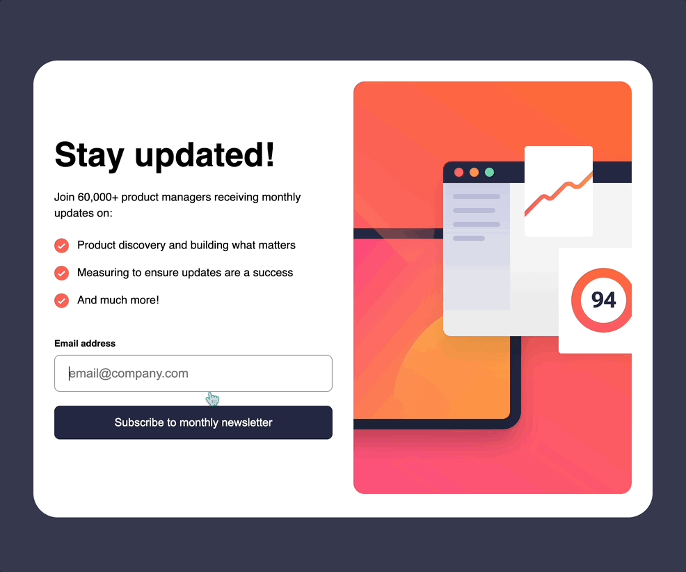
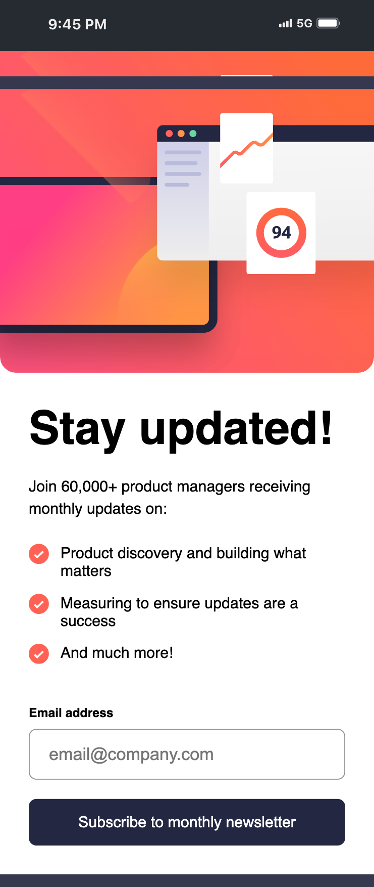

# Newsletter Sign-up Form with Success Message

Essa é uma solução para o [Desafio: "Newsletter Sign-up Form with Success Message" do Frontend Mentor](https://www.frontendmentor.io/challenges/newsletter-signup-form-with-success-message-3FC1AZbNrv). Os desafios que esse site oferece ajuda desenvolvedores a melhorar suas habilidades de código!

## O Desafio

Usuários devem poder:

- Entrar um email válido, assim enviando o formulário

- Ver mensagem de erro se:

  - O formulário estiver vazio

  - O email digitado não estiver formatado corretamente

- Ser direcionado para uma página de sucesso ao enviar o formulário

- Ver na página de sucesso uma mensagem com o email digitado pelo usuário

- Ver o layout ideal para o conteúdo dependendo do tamanho da tela do dispositivo

- Ver os estados hover para todos os elementos interativos da página

## Tecnologias Utilizadas

- HTML

- CSS

- JavaScript

## Aprendizado

- Fiz um site de mais de uma página pela primeria vez

- Aprendi a usar o `sessionStorage` e o `localStorage` para *armazenar* o email digitado pelo usuário, além de aprender a quando usar cada um deles e sua relação com *segurança dos dados do usuário*

- Pratiquei o uso de `import` e `export` de módulos entre scripts

- Pratiquei a separação de funções, onde faço a refatoração do código para que cada função faça uma tarefa diferente

## Preview

### Showing active and interactive states

### Mobile design

